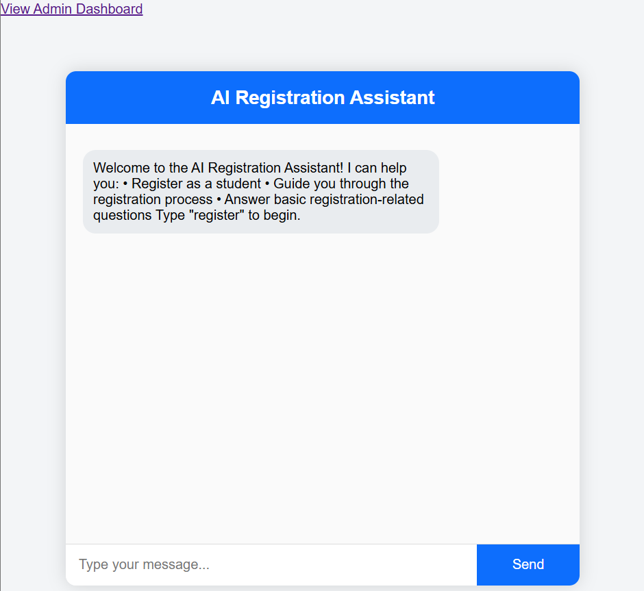
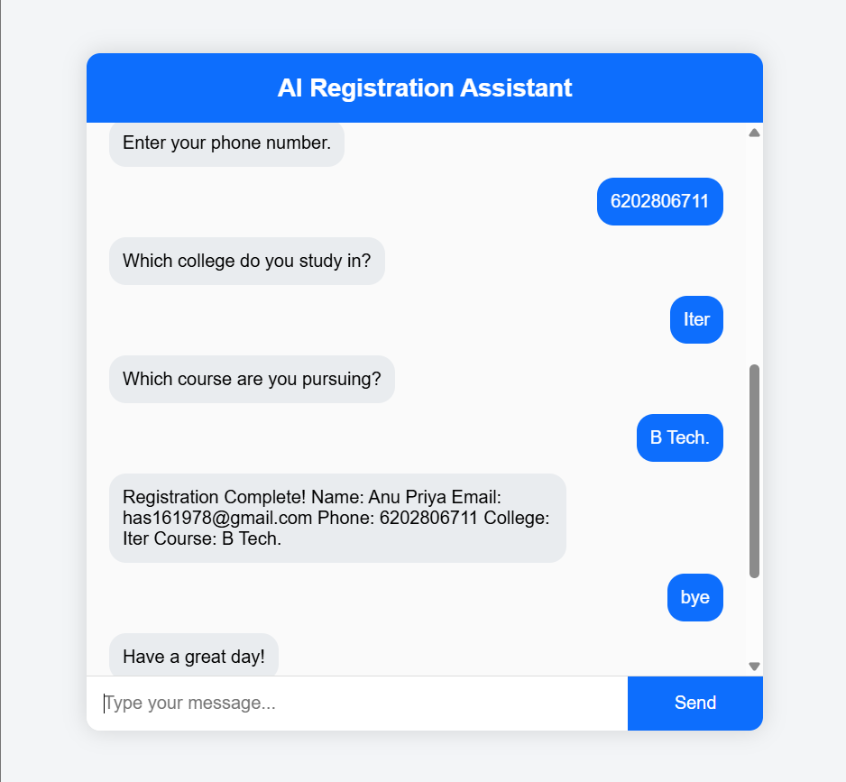
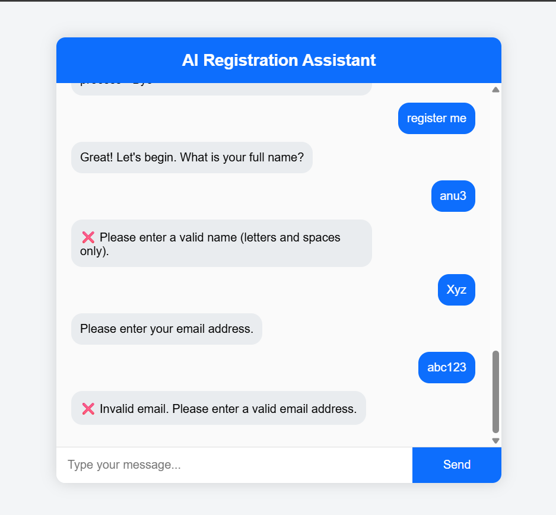
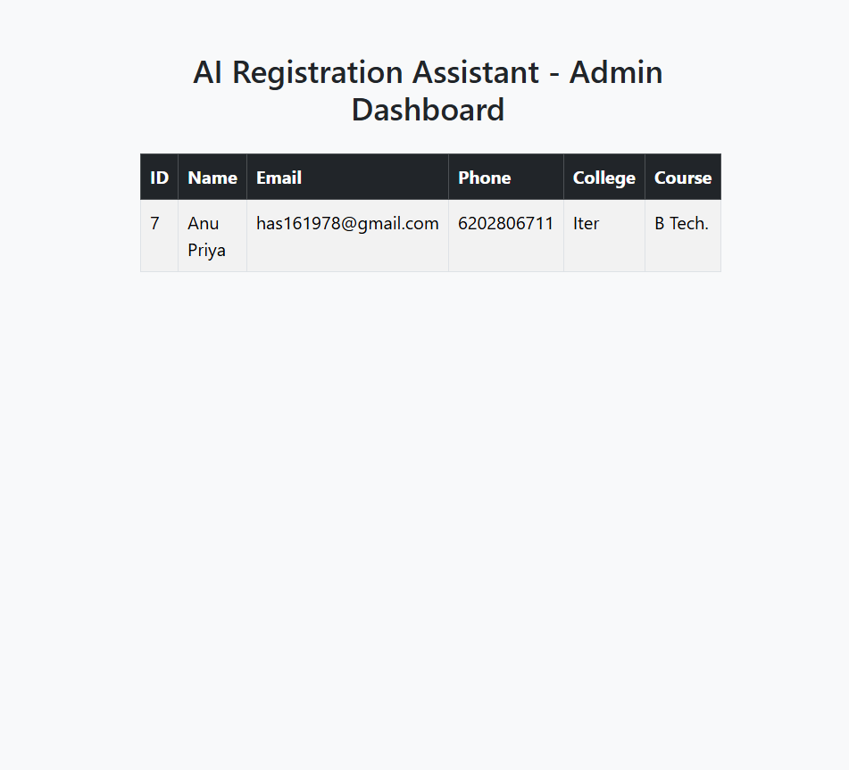

# AI Registration Assistant

An intelligent chatbot-based registration system built using **Python**, **Flask**, **Scikit-learn**, **NLTK**, and **SQLite**. The application uses Natural Language Processing (NLP) and Machine Learning to understand user queries and guide users through a multi-step registration process.

---

## Features

- AI-powered chatbot for student registration
- Intent classification using Machine Learning (Naive Bayes)
- Multi-step registration workflow
- Input validation for user details
- SQLite database for storing registrations
- Admin dashboard to view all registrations
- Unknown intent handling with confidence threshold
- Responsive web interface using HTML, CSS, JavaScript, and Bootstrap

---

## Technologies Used

- Python
- Flask
- Scikit-learn
- NLTK
- SQLite
- HTML5
- CSS3
- JavaScript
- Bootstrap
- Git & GitHub

---

## Project Structure

```text
AI_Registration_Assistant/
│
├── app.py
├── chatbot.py
├── train.py
├── clear_database.py
├── view_db.py
├── requirements.txt
├── model.pkl
├── vectorizer.pkl
├── database.db
│
├── data/
│   └── intents.json
│
├── utils/
│   └── preprocess.py
│
├── templates/
│   ├── index.html
│   └── admin.html
│
├── static/
│   ├── style.css
│   └── script.js
│
├── Screenshots/
│   ├── home.png
│   ├── registration-success.png
│   ├── validation.png
│   └── admin-dashboard.png
│
└── README.md
```

---

## Installation

### Clone the repository

```bash
git clone https://github.com/Anupriyaa29/AI_Registration_Assistant.git
```

### Move into the project directory

```bash
cd AI_Registration_Assistant
```

### Install dependencies

```bash
pip install -r requirements.txt
python -m nltk.downloader punkt stopwords wordnet
```

### Train the model

```bash
python train.py
```

### Run the application

```bash
python app.py
```

---

## Sample Conversation

```
User: Register

Bot: Great! What is your full name?

User: Anu Priya

Bot: Please enter your email address.

User: anu@gmail.com

Bot: Enter your phone number.

User: 9876543210

Bot: Which college do you study in?

User: ITER

Bot: Which course are you pursuing?

User: B.Tech CSE

Bot: Registration completed successfully!
```

---

## Screenshots

Here are sample screenshots from the application:

- Home Page: 
- Registration Success: 
- Validation Messages: 
- Admin Dashboard: 

---

## Future Improvements

- User Login & Authentication
- Email Confirmation
- Export Registrations to CSV
- Analytics Dashboard
- Deployment on Render or Railway
- Advanced NLP model

---

## Author

**Anu Priya**

B.Tech Computer Science & Engineering

---

## License

This project is developed for educational and internship purposes.
